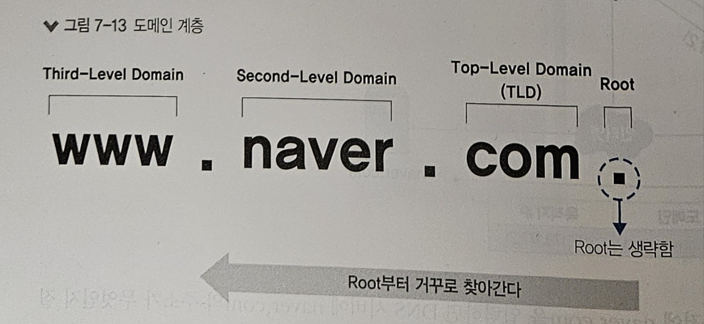
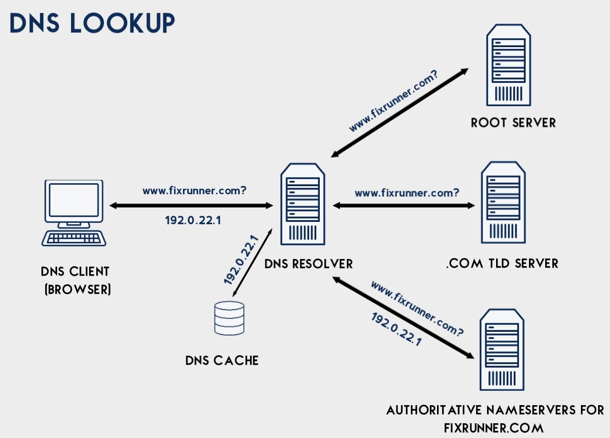
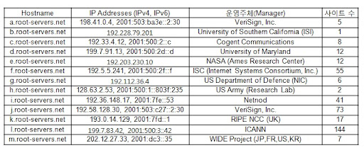
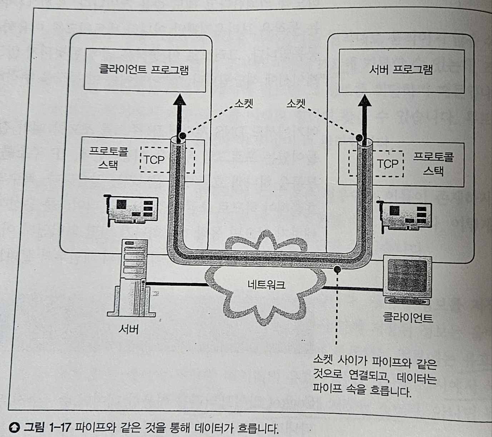
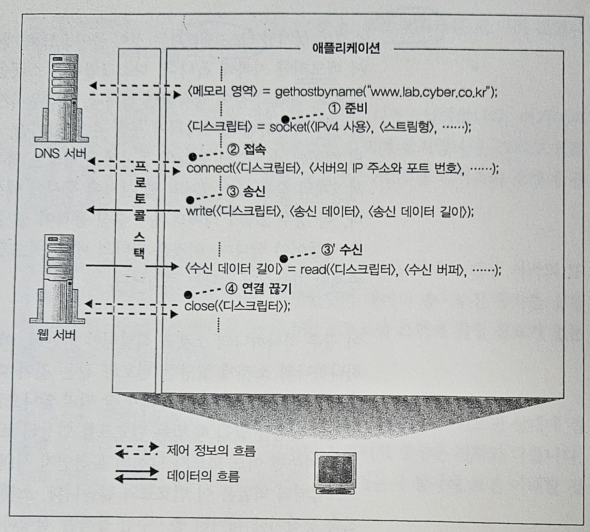

# DNS 서버 / 데이터 송수신

> 발표일 `25.02.27`
>
> 발표자 `공병규`

## 목차

story 03 : 전 세계의 DNS 서버가 연대한다

- DNS 서버의 기본 동작
- 도메인의 계층

story 04 : 프로토콜 스택에 메세지 송신을 의뢰한다

- 데이터 송수신 동작 개요

## Story 03 : DNS 서버

### 지난 스터디 회고

- DNS 서버 : URL을 IP 주소로 변환
- 소켓 라이브러리에 DNS resolver가 존재

### 1. DNS 서버로 요청 보내기

매핑 구성

- 이름 (서버 url, 메일의 경우 호스트)
- 클래스
  - 초창기에 인터넷 이외에서도 dns가 쓰일 것으로 예상하고 만들어짐
  - 현재는 인터넷을 나타내는 `IN` 만 쓰임
- 타입

  - 이름에 어떤 종류의 정보가 지원되는지
  - A의 경우 IP 주소가, MX의 경우 메일 배송 목적지를 나타냄
  - MX에서 앞의 숫자는 preference 의미
  - 이외에도 PTR, CNAME, NS, SOA 등이 존재
    - PTR : IP 주소를 도메인 주소로 변환
    - CNAME : 별칭 도메인 주소를 원래 도메인 주소로 변환
      - e.g. www.naer.com -> naver.com
    - SOA : 도메인 내 영역(zone)에 대한 권한을 나타냄
    - NS : 도메인 영역의 네임 서버를 가리킴

### 2. 도메인의 계층

인터넷에는 막대한 수의 IP 주소, 서버가 존재

전부 1대의 DNS 서버에 저장시키는 것은 비효율적

계층적 구조를 이용해서 부하를 분산시키고 정보를 체계적으로 관리 가능

점(.)을 기준으로 계층(도메인)을 나눔

쿼리자와 가장 가까운 로컬 DNS 서버에서 결과를 얻을 때까지 각 계층에 dns 질의 수행

각 도메인 DNS에서 자기 바로 하위 도메인의 DNS IP주소를 알고 있음

쿼리에 대한 답을 TTL을 두고 캐시에 저장해서 성능을 향상

#### 루트 도메인

전 세계에 13개가 존재

## Story 04 : 프로토콜 스택과 소켓

### 데이터 송/수신 동작

1. 소켓을 만든다
2. 서버 측 소켓에 파이프를 연결
3. 데이터를 송/수신
4. 파이프를 분리하고 소켓 제거

OS 내부의 프로토콜 스택이 애플리케이션의 의뢰를 받아 실행

### 각 단계 별 상세

0. DNS 리졸버로 IP 주소를 받아온다
1. 소켓을 만든다
   - 소켓을 식별하는 descriptor를 받음
2. 서버 측 소켓에 파이프를 연결
   - connect 를 호출
   - 인자로 descriptor, 서버의 ip, port
   - 소켓을 만들 때 클라이언트 측에 자동으로 단기 포트가 할당됨
3. 데이터를 송/수신
   - `write` 를 이용해서 데이터 전송
   - `read` 를 이용해서 데이터 수신
4. 파이프를 분리하고 소켓 제거
   - 받는 측에서 `read`를 호출하고 연결이 끊김을 감지
   - close를 호출해서 연결을 끊음
