# Packet

## Encapsulation

계층별 헤더 또는 트레일러를 연결하여 컴퓨터 네트워크를 통해 정보를 전송하는 컴퓨터 네트워킹 프로세스

- Application Layer
  - ex. HTTP
  - message
- Transport Layer
  - ex. TCP
  - Segment
- Network Layer
  - ex. IP
  - Packet/Datagram
    - with several Fragments (No Fragmentation for ipv6)
- Link Layer
  - ex. Ethernet
  - frame
    - pcap -> packet analyzer
- ~~Physical Layer~~
  - ~~bit/signal~~

### Fragmentation

각 link는 다른 MTU를 가질 수 있다

Router Level
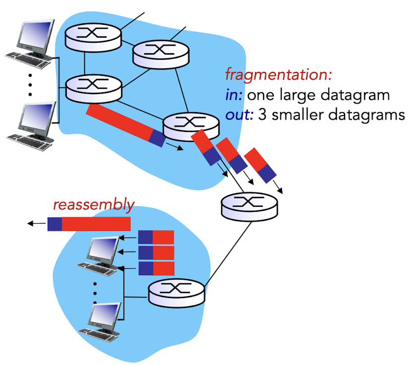

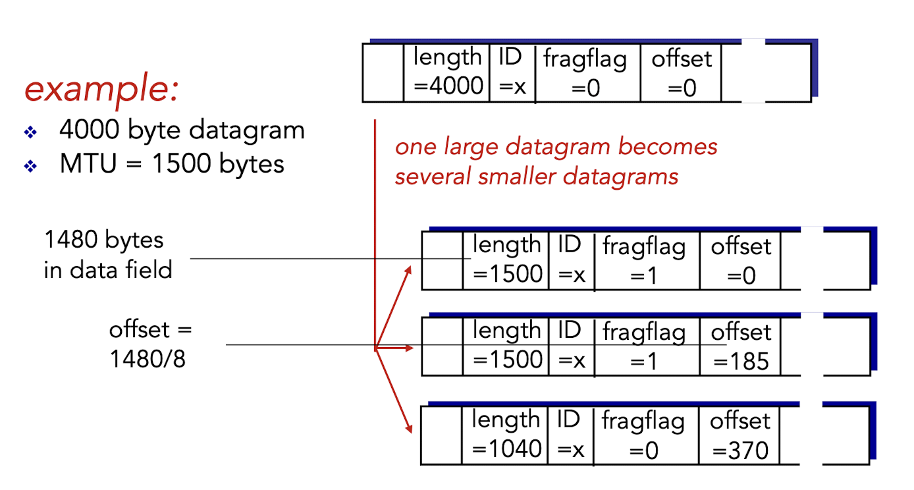

Ipv6

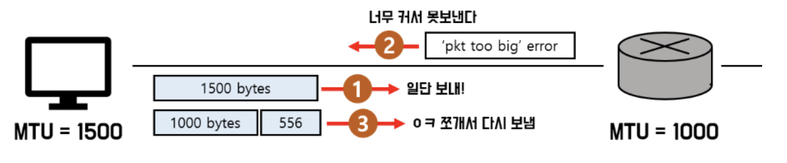

# Link Layer Service

- Layer2 packet `Frame`은 Layer3 packet `DataGram`을 캡슐화
  - MAC 헤더 - IP 헤더
- Datagram을 Frame으로 감싸 인접한 노드로 링크를 통해 전달

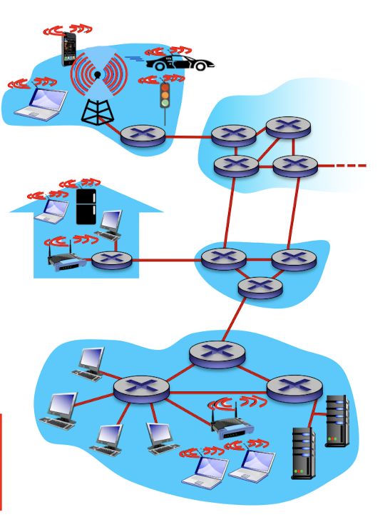

- flow control
- error detection
  - detect error -> drop or request retransmit
- error correction
  - corrects bit error (no retransmit)
- half & full duplex

# ARP

네트워크 상에서 IP 주소를 물리적 네트워크 주소로 대응(bind)시키기 위해 사용되는 프로토콜

router는 subnet 내에 destination host가 존재한다는 것을 IP를 통해 알 수 있다.
그럼 subnet 내부에서 어떤 노드에게 패킷을 전달해야할까?

## MAC address

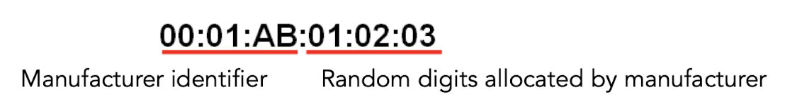

서브넷 내부 노드 식별

### IP address vs MAC address

- Hardware vs Software
- NIC / Modem chip vs OS

- pros
  - fast
- cons
  - inflexible
  - expensive

## Detail

router broadcast ARP request message (cache)

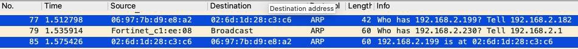

ARP response with subnet address(MAC address)

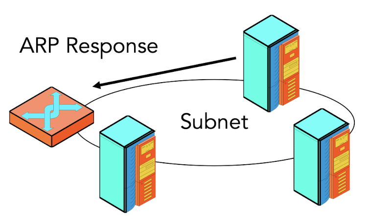

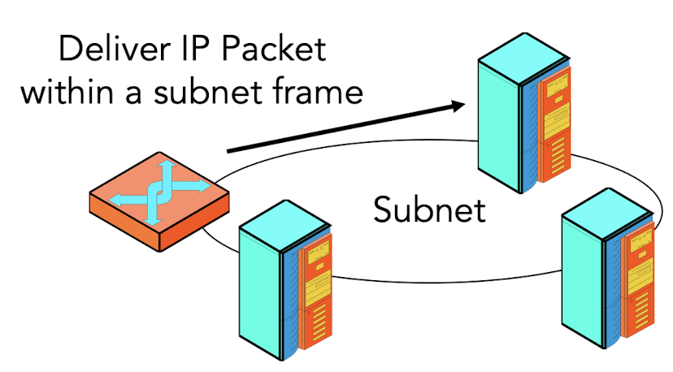

# Link Layer Header

## Ethernet

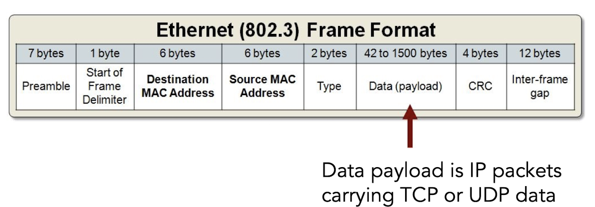

- clock skew
  - clock signal && data signal
- Preamble
  - clock 타이밍 동기화
- Start of Frame Delimiter
  - 실제 frame 데이터 시작점 구분
- CRC (Cyclic Redundancy Check)
  - Error detection
  - frame에 CRC 계산식을 적용한 값과 frame 끝 CRC 값 비교
- IFG
  - inter frame gap on half-duplex
  - for `fairness`
- types
  - point to point (full duplex)
  - broadcast

p. 165 그림 2-22

### LAN Driver / NIC

`interrupt OS`

or

`DMA`

## Wifi

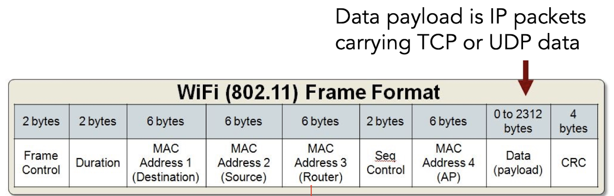

- D2D connection X
  - 연결 간 interference 방지

# Multiple Access Protocol

## How to detect collision?

- positive ACK
- energy level detection

`Collision을 해결하자`

## Chanel Partitioning

### TDMA

`time division multiple access`

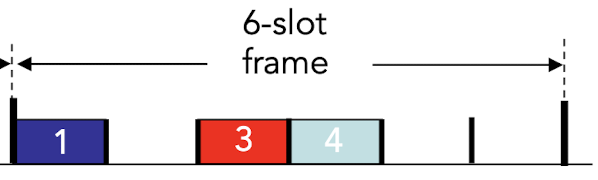

### FDMA

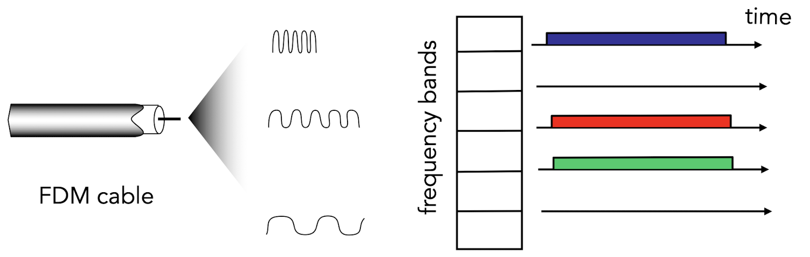

### CDMA

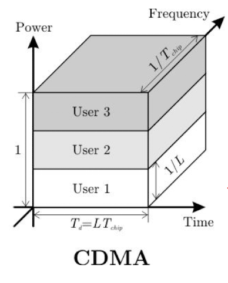

- Cellular vs Wifi
  - 네트워크 내부 사용자 수 변화

## Random Access

### ALOHA

- Pure
  - frame이 생기면 곧바로 전송 (No channel listen)
  - ACK 대기
  - Backoff limit까지 재전송
- Slotted
  - synchronization time slot
  - collision → random wait → retry

### CSMA

- 1-persistent
  - chanel 상태를 지속적으로 확인 -> idle 감지 -> frame 즉각 전송
- non-persistent
  - chanel이 busy하다면 랜덤하게 대기 후 다시 감지 -> idle 감지 -> frame 즉각 전송
- p-persistent
  - chanel 상태를 지속적으로 확인 -> idle 감지 -> p 확률로 frame 전송
  - (1-p) 확률로 T만큼 기다리다가 재시도

+CSMA/CD, CSMA/CA

# UDP

- Real-time Streaming APPs
  - loss tolerant / rate sensitive
- No Connection
- No Congestion Control (Best-effort)
- No Retransmit Delay

## RDT

- error detection
  - checksum

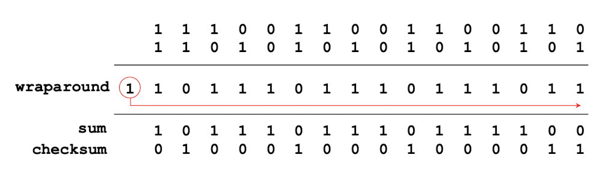
