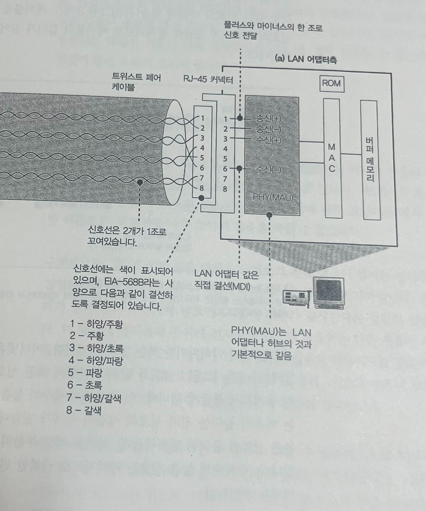
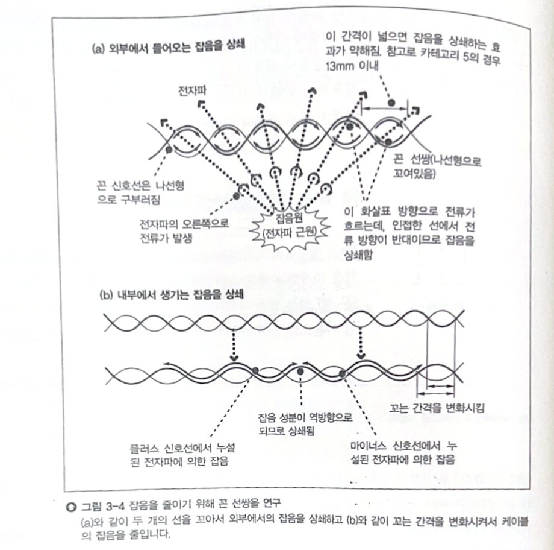
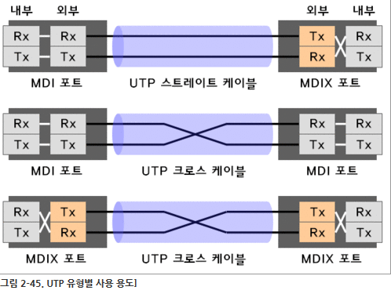
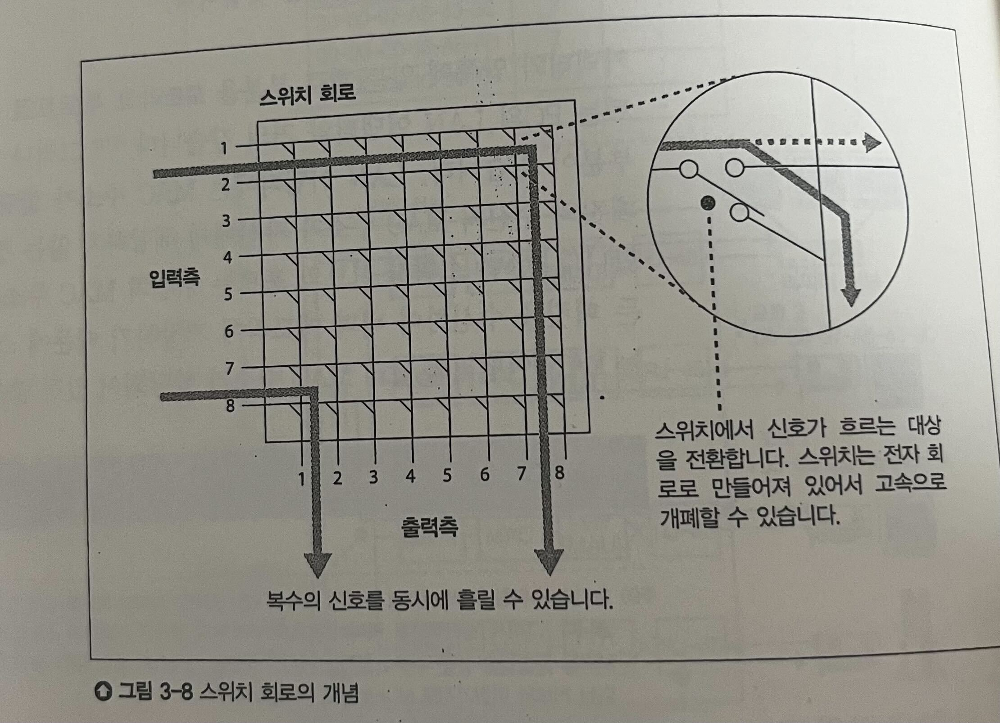
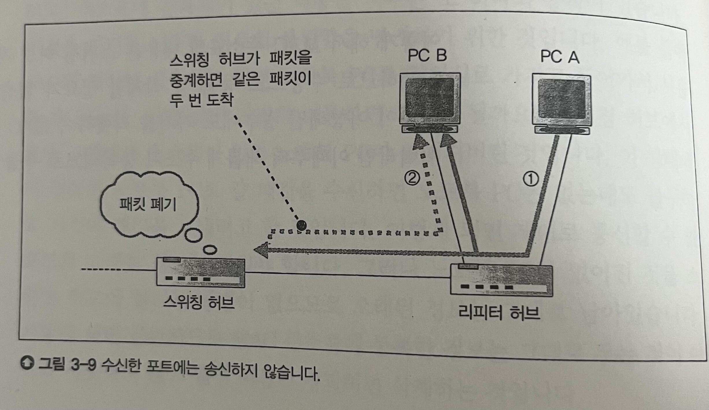

# LAN

- 이 장에서 배우는것: LAN 어댑터에서 출발한 패킷들이 스위칭 허브, 라우터 등을 경유해서 인터넷으로 전송되는 과정

## LAN 케이블

- 패킷은 LAN 어댑터의 PHY(MAU) 회로에서 전기신호 형태로 변경
- 전기 신호 형태로 케이블을 통해 인터넷으로 전달됨

- 케이블의 목표: 패킷을 인터넷으로 보내면서 장거리 통신으로 인한 전기 신호의 변형을 최소화
  - 전기 신호의 변형 -> 통신 오류 발생
    - 장거리를 이동할수록 에너지가 떨어져서 신호가 약해짐
    - 한 신호 주기안에서도 에너지의 방출량이 달라서 파형이 변형됨
    - 잡음의 삽입

- 잡음의 억제: Twisted Pair Cable(꼰 선쌍)
  - 잡음의 생성 원리
    - 케이블 주위의 전자파가 전류를 생성
    - 생성된 전류가 패킷의 신호와 충돌 -> 전기 신호 파형의 변형
    - 외부에서 들어오는 잡음: 모니터, 형광등 등 외부 기기에서 나오는 전자파
    - 내부에서 생성되는 잡음: 다른 신호선 안에 흐르는 전류가 전자파 생성 -> 전자파가 잡음 생성
      - crosstalk(크로스토크): 다른 쌍의 신호선이 생성하는 잡음에 의한 영향
      - 기본적으로 외부에서 생성되는 잡음보다는 약하지만 근원이 신호선과 더 가까워서 영향을 받게 됨
  - 패킷을 이루는 전기신호는 PHY 회로의 (+)와 (-) 신호 단자의 쌍에서 생성
    - 외부에서 들어오는 잡음의 상쇄
      - 한 방향에서 전자파가 들어올 때 해당 방향 기준으로 원형으로 전류가 생성
      - 두 신호선이 생성하는 나선의 각 구멍마다 원형으로 전류 생성
      - 두 신호선이 서로 꼬여있어서 선이 서로 겹치는 부분마다 전류가 반대방향으로 만남 -> 서로 상쇄
    - 내부 잡음의 상쇄
      - 신호선을 꼬는 간격을 균등하게 하지 않고 서로 다르게 만듦
      - 한 신호선이 다른 신호선 쌍에 대해서 어느 부분은 (+) 신호선이 더 가까워서 영향을 많이받고 다른 부분은 (-) 신호선에 의한 잡음 전류가 생성됨
      - 각 방향의 전류가 서로 상쇄됨
    - STP(Shielded Twisted Pair): 전자파 차단을 위해 신호선을 둘러싼 금속성의 차폐 추가
      - UTP(Unshielded Twisted Pair)보다 외부 전자파에 대한 내성이 높아지지만, 비용이 비싸고 무거움

## 리피터 허브

- 리피터 허브의 역할: 먼 위치까지 패킷을 잘 전달하기 위해 통신 가능한 거리를 연장
- 리피터 허브는 패킷을 수신한 뒤 리피터 회로를 통해 연결된 모든 기기들에게 패킷을 다시 전달
  - 리피터와 연결된 모든 기기들은 패킷을 수신
  - 패킷의 MAC 헤더를 확인해서 수신한 LAN 어댑터의 MAC 주소가 패킷의 수신 MAC 주소와 동일하다면 패킷을 받고, 아니면 무시
  - 몇몇 종류의 리피터들은 통신 중간에 전기신호의 변형을 확인하고 복원하는 기능을 수행하기도 함
- MDI와 MDI-X: 포트와 송신/수신 단자간 전환 스위치
  - 각 회선의 한쪽 끝은 송신 단자와 연결되고 반대쪽 끝은 수신 단자와 연결되어야 함
  - MDI와 MDI-X는 서로 구조가 반대 -> 연결하려는 두 기기가 각각 MDI와 MDI-X를 가지고 있다면 바로 연결 가능(다이렉트 케이블)
    - 서로 동일한 스위치를 가지고 있다면 회선을 교차해서 연결해야 함(크로스 케이블)
    - 기기를 만들 때 해당 종류의 기기가 어떤 종류의 기기들과 주로 연결하는지, 그 연결될 기기들은 어떤 형태의 전환 스위치를 사용하는지에 따라서 전환 스위치 결정
  - Auto MDI-X: 기기에서 연결된 케이블이 크로스 케이블 형태인지, 다이렉트 형태인지를 판단해서 알아서 케이블과 연결된 포트와 송신/수신 단자 사이 연결을 조절

## 스위칭 허브

- 스위칭 허브의 역할: 패킷의 MAC 주소에 따라 알맞은 목적지로 패킷을 전송
- 스위칭 허브는 신호를 수신한 뒤 디지털 데이터로 변환해서 패킷의 MAC 주소를 확인 -> 자신이 들고 있는 MAC 주소 테이블에서 해당 주소가 연결되어있는 스위치의 포트를 확인 -> 해당 포트로 패킷 전송
  - 스위칭 허브의 신호 수신 동작은 LAN 어댑터와 매우 유사하지만, MAC 주소의 검증 없이 모든 주소의 패킷을 다 수신함

### MAC 주소 테이블

- MAC 주소와 해당 주소가 연결된 스위치의 포트 번호를 매핑
- MAC 주소 테이블의 갱신
  - 스위치가 패킷을 수신하게 되면 그 패킷의 송신처 MAC 주소와 패킷이 들어온 포트 번호를 매핑해서 저장
- 오래된 정보의 삭제
  - 테이블에 등록된 정보가 일정 기준 시간이 경과하도록 사용이 없다면 테이블에서 삭제

### 스위치 회로

- 입력 포트와 출력 포트를 이어주는 격자 형태의 스위치들의 모음
- 패킷이 이동해야 할 출력 포트가 정해지면 두 포트 사이를 신호가 이동할 수 있도록 스위치들이 방향 전환
- 여러 개의 신호를 동시에 수송 가능
- 리피터 허브의 경우 신호를 모든 포트로 전송해야 함 -> 동시에 두 개 이상의 신호를 중계할 경우 충돌할 수 있음

### 예외적인 경우들

- 수신해야 할 포트와 패킷이 들어온 포트가 동일한 경우
  - 패킷을 폐기

- 패킷의 MAC 주소에 해당하는 항목이 MAC 테이블에 없는 경우
  - 패킷을 수신한 포트 이외의 전체 포트로 전송
- 패킷의 MAC 주소가 브로드캐스트 주소인 경우
  - 패킷을 수신한 포트 이외의 전체 포트로 전송

### 반이중, 전이중, 자동 조정

- 기본적으로 여러대의 기기가 동시에 신호를 송신한다면 충돌할 수 있음
- 반이중 모드: 이더넷에 신호가 흐르고 있을 때는 신호 송신 불가능
  - 충돌 검사: 송신을 진행할 때 이미 다른 신호가 전송되고 있는지 확인
- 스위치 허브의 경우 신호선과 포트, 단자가 모두 송신, 수신이 나누어져 있기 때문에 충돌 X
- 전이중 모드: 충돌 검사를 무시하고 수신하고 있는 신호가 있어도 동시에 송신 가능
- 자동 조정: 반이중과 전이중 모드 간 자동으로 전환
  - 전송 대상이 지원하는 모드를 검사
  - 링크 펄스: 회선에서 데이터가 전송되지 않고 있을 때 자신의 상황을 연결된 상대 기기에게 전송하는 신호
    - 지원하는 전이중/반이중 모드, 최대 전송 속도
    - 상대는 링크 펄스를 읽고 건너편의 기기가 어떤 모드를 지원하는지 확인
    - 두 기기가 모두 지원하는 모드와 전송 속도 중 가장 우선순위가 높은 체제로 전송
