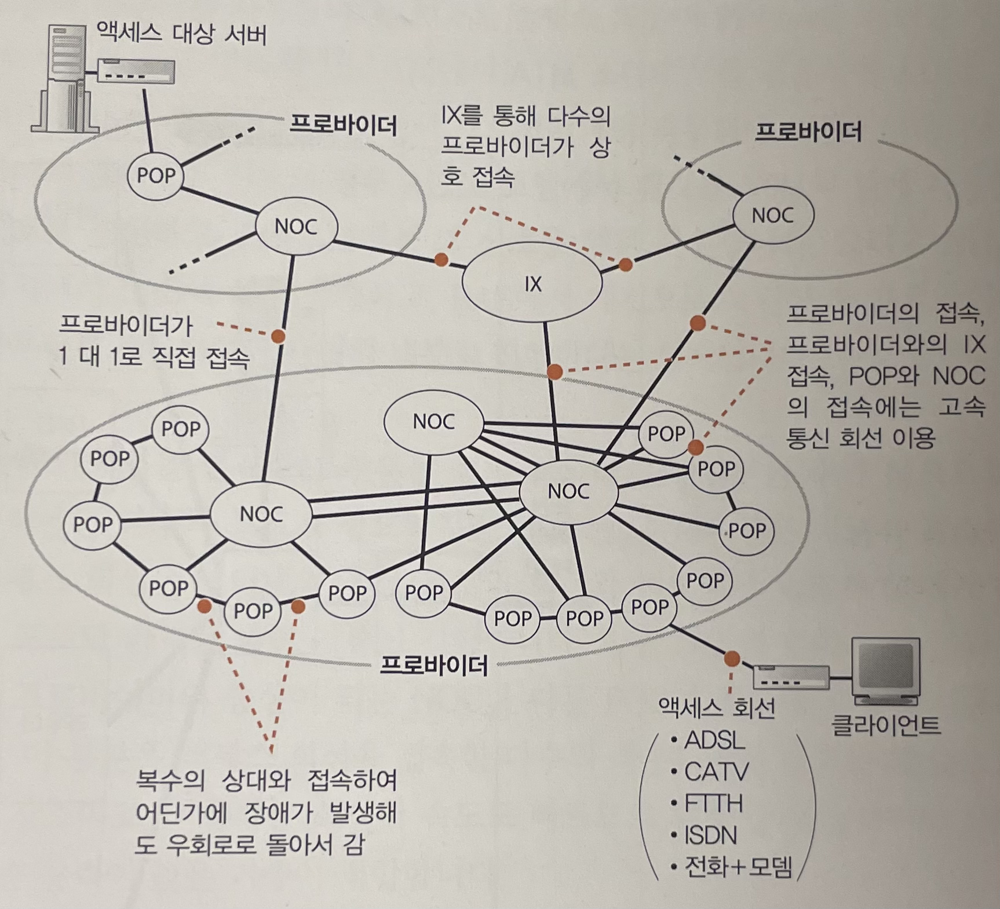
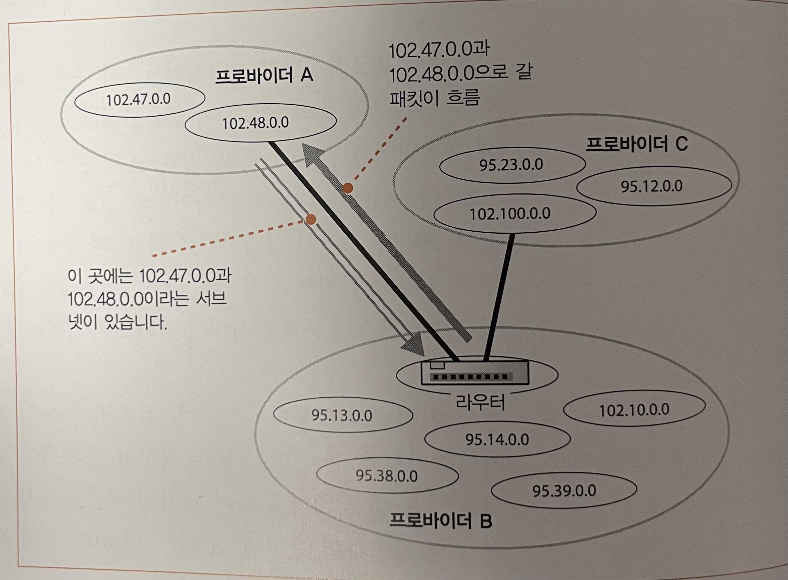

# Story 5 프로바이더를 경유하여 흐르는 패킷

- 엑세스 회선을 통과한 패킷은 프로바이더의 라우터에 도착한다.

## 프로바이더란?

-> 인터넷의 실체는 한 개의 조직이 운영 관리하는 단일 네트워크가 아니라 다수의 프로바이더의 네트워크를 서로 접속한 것 (p. 308)
-> 프로바이더에는 다양한 유형이 있고, 계층적 구조를 띈다 (src: https://www.youtube.com/watch?v=IrE6RlcXVdk) 하위 프로바이더가 상위 프로바이더의 인터넷에 의존(구매)하는 구조

- 국가간 연결 - tier 1 Backbone Internet Provider - 해저 케이블
- 지역(구, 주)간 연결 - tier 2 Regional Internet Provider
- 지역(시)간 연결 - tier 3 Local Internet Provider

## 프로바이더끼리의 접속

### POP 와 NOC

### 프로바이더끼리의 접속

- 서버 (도착지)와 클라이언트가 같은 프로바이더에 속한 경우
  - 프로바이더 내부 라우터끼리는 경로 정보를 교환하고, 경로표에 자동으로 이를 등록한다
  - 따라서 프로바이더 내부 라우터들 사이 경로표를 따라가다보면 메시지가 서버에 도착한다
- 서버 (도착지)와 클라이언트가 다른 프로바이더에 속한 경우
  - 이때의 중계 대상도 경로표에 등록되어 있다
  - 프로바이더는 다른 프로바이더와도 경로 정보를 교환한다

결국 다 찾아갈 수 있다

### 프로바이더끼리 경로 정보 교환하기

- 경로 정보는 어떻게 해서 등록 되는가?

BGP 구조 p.317

- 트랜지트 (transit)
- 접속 상대에게 전체 경로를 통지
- 비트랜지트 또는 피어
- 해당 프로바이더에 연결된 네트워크만 통지

### 사내 네트워크에서 자동 등록하기

- 사내 네트워크에서 사용하는 방법은 프로바이더끼리 경로 정보를 교환하는 방법과 차이점이 있다.

  - 사내 네트워크는 무차별적인 경로 정보 교환을 한다 -> 최단 경로를 찾아내기 위함

- 프로바이더는 왜 안되는가?

  - 통신 회선을 계약한 주체를 구별해야하기 때문

- 프로바이더가 경로 정보를 교환하는 상대를 지정할 수 있다

- 그럼 혹시 프로바이더가 계약을 안해서 웹 서버에 접근하지 못하는 경우도 생기나?
  -> 그런 상황은 발생 안하게 계약을 한다. 이것이 불가능하다면 프로바이더로서 살아남을 수 없다

### IX의 필요성

- 프로바이더끼리는 1대1 형태로 접속하는 것이 기본 형태이다.
- 하지만 이것은 불편하다 -> IX 를 경유해서 프로바이더들끼리 정보를 주고 받게 하여 통신 회선의 수를 줄일 수 있게 해줌 p.320

### IX에서 프로바이더끼리 접속하는 모습

- 내진설계가 잘 되어 있는 건물 어딘가에 IX가 있고, IX의 중심에는 고속 LAN의 인터페이스를 다수 장착한 레이어2 스위치가 있다.
- 레이어 2 스위치의 기본 동작은 스위칭 허브와 같으므로, 고속으로 거대한 스위칭 허브가 IX 의 핵심이 되었다고 생각하면 될 것 같다.

- 패킷의 이동 경로

  - 라우터에서 패킷을 송신할 때 ARP 에서 중계 대상 라우터의 인터페이스의 MAC 주소를 조사하여 이것을 MAC 헤터에 기록하여 패킷을 보낸다.
  - 헤더에 mac 주소를 기록하면 어느 프로바이더의 라우터에도 패킷을 보낼 수 있다.

# Ch 5.

4장에서는 인터넷에 들어간 패킷이 통신 회선이나 프로바이더의 네트워크를 통해 서버측의 PO로 운반되는 모습을 탐험했습니다.
이후 패킷은 서버를 향해 나아가서 서버의 바로 앞에 있는 방화벽, 캐시 서버, 부하 분산 장치 등을 통과하는데, 이 장은 그 부분을 탐험합니다.

1. 웹 서버의 설치 장소

- 서버는 어디에 있는 것인가?

2. 방화벽의 원리와 동작

- 어떤 개념과 구조로 웹 서버를 지키는 지?

3. 복수 서버에 리퀘스트를 분배한 서버의 부하 분산

- 여러 대의 웹 서버를 갖추어 부하를 분담하는 방법

4. 캐시 서버를 이용한 서버의 부하 분산

- 캐시 서버의 다양한 사용법 (서버 쪽에 캐시 or 클라이언트 쪽에 캐시)

5. 콘텐츠 배포 서비스

- 캐시 서버를 발전시킨 것으로, 인터넷 전체에 다수의 캐시 서버를 배치하고 사용자로부터 가장 가까운 캐시 서버에 엑세스하도록 처리.
- 가장 가까운 캐시 서버는 어떻게 찾는가?

## 웹 서버의 설치 장소

### 사내에 웹 서버를 설치하는 경우

### 데이터센터에 웹 서버를 설치하는 경우

