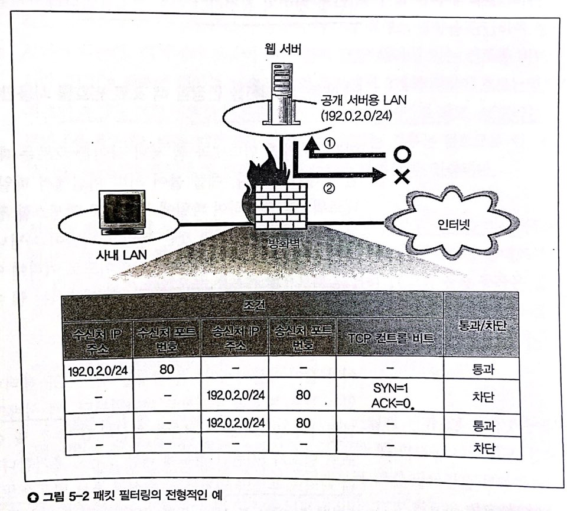
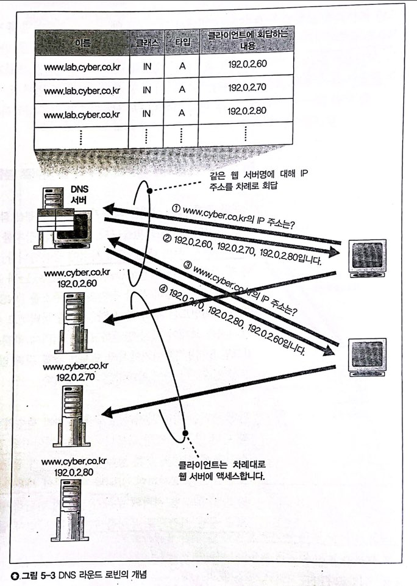

> 발표일 `25.04.03`
>
> 발표자 `서형석`

# Story 2 방화벽의 원리와 동작

방화벽 기본 개념

    - 특정 서버 또는 서버 내 특정 어플리케이션에 액세스하는 패킷만 통과
    - 패킷 필터링, 애플리케이션 게이트웨이, 서킷 게이트웨이형 존재
    - 성능, 비용, 편의성이유로 패킷 필터링형이 널리 보급

### 상황
- 공개 서버용 LAN과 사내 LAN 분리. 웹 서버는 공개 서버용 LAN에 접속
- 인터넷에서 웹 서버에 대한 액세스를 허가하지 않으면, 웹 서버에서 인터넷으로 나가는 패킷을 차단

## 1. 패킷 필터링 조건 설정
### 조건
1) 기본 조건: 수신처 IP, 송신처 IP에 따라 시점과 종점 판단
    - 인터넷에서 들어오는 패킷: 시점 = 지정 불가, 종점 = 웹 서버
    - 인터넷으로 나가는 패킷: 시점 = 웹 서버, 종점 = 지정 불가
2) 애플리케이션 한정 조건: 포트 번호
    - 웹 서버는 80번 포트 사용. 1,3행에 포트 추가
3) 접속 방향 판단 조건: 컨트롤 비트
    - 웹 서버에서 인터넷으로 흐르는 패킷을 정지시키면, 인터넷에서 웹 서버에 액세스하는 동작도 정지
    - 패킷의 방향이 아닌 액세스 방향을 판단해 정지시켜야 한다
    - 3-way handshake에서 최초의 패킷: SYN 1 ACK 0
### 설정 원칙
- 허가하는 액세스 동작에서 흐르는 패킷과 그 외를 __완전히__ 선별할 수 있을때까지 조건 추가
- 필요한 것만 통과하고, 나머진 전부 차단 _(마치 한국 법)_

#### 완전히 선별할 수 없는 경우: UDP
- handshake 과정 X, 컨트롤 비트 X -> 액세스 방향 판단 불가
- 대표적으로 DNS 서버 조회
    - 사내에서 인터넷 DNS 서버 액세스 허가하고, 인터넷에서 사내 DNS 서버 엑세스 차단 불가
    - 둘 다 허용하거나, 둘 다 차단만 가능
- UDP를 사용하는 애플리케이션은 모두 공통

## 2. 사내 LAN 조건 설정
### 사내 LAN <-> 인터넷, 사내 LAN <-> 공개 서버용 LAN 조건 설정
- 서로 악영향을 끼치지 않도록 주의
- ex. 사내 LAN과 공개 서버용 LAN 조건 설정
    - 수신처 IP: 공개 서버용 LAN, 송신처 IP: -
    - 인터넷에서 흘러온 패킷이 공개 서버용 LAN에 유입 가능
### 주소 변환 설정
- 패킷의 시점과 종점을 조건으로 지정, 주소 변환 필요시 수행
- 주소 변환시, 인터넷측에서는 사내 LAN에 접속 불가. __패킷 필터링 조건 설정 필요 없음__.

## 3. 방화벽으로 막을 수 없는 공격

### 상황
    특수한 데이터를 포함한 패킷을 받으면 웹 서버 다운
 
- 방화벽은 시점과 종점만 조사하므로 패킷 통과 -> 웹 서버 다운
### 두 가지 대처법
- 버그 픽스
    - 보안 구멍 정보를 수집해 새로운 버전으로 갱신
- 패킷 내용 조사
    - 위험한 데이터가 포함된 경우 패킷을 차단
    - 완벽하진 않음
        - 버그가 있는지 없는지가 main factor.

 
 

# Story 3 복수 서버에 리퀘스트를 분배한 서버의 부하 분산

## 1. 처리 능력이 부족하면 복수 서버로 부하 분산된다

서버에 엑세스가 증가한다 -> 서버로 통하는 회선을 빠르게 한다
- 회선에서 오는 대량의 패킷에 서버의 처리 능력이 부족할 수 있다
- 특히 페이지 데이터를 동적으로 만드는 경우 컴퓨팅 자원 소모 크다

처리량을 높이자
- 비싼 서버 머신 쓰기 (수직적 확장)
    - ex. ec2 t2.micro -> t5.large 딸깍
- 서버를 증설해 서버당 트래픽 낮추기(수평적 확장): 분산처리

### DNS 서버를 통한 부하 분산

과정
- DNS 서버에 같은 이름의 여러 웹 서버 등록
- 조회 시 결과가 하나씩 shift (라운드 로빈)

단점
- 웹 서버가 죽어도 라운드 로빈으로 동작
- 복수의 페이지에 걸쳐 전체 요청을 처리하는 경우 처리 불가
    - ex. 쇼핑, 회원가입 - 주소, 성명 입력 후 신용카드 번호 입력

## 2. 부하 분산 장치(로드 밸런서)를 이용해 복수의 웹 서버로 분할된다

### 과정
1. 로드 밸런서를 웹 서버 대신 DNS 서버에 등록
2. 부하 분산
- 2-1. 복수의 페이지에 걸쳐있지 않은 요청일 경우 -> 웹 서버 부하 상태에 따라 로드 밸런싱
    - CPU, Memory usage
    - 응답 시간

    부하 조사시 딜레마
    - 잦은 조사 -> 로드 밸런싱 능력 증가, 트래픽 증가
    - 드문 조사 -> 트래픽 감소, 로드 밸런싱 능력 감소
    서버 성능 설정, 비율에 따라 요청 분배

- 2-2. 복수의 페이지에 걸쳐있는 요청일 경우 -> 웹 서버 부하에 관계없이 이전 요청이 전송된 서버에 전송
    - 여러 HTTP 요청이 하나로 묶여 있는지 판단. 
    - 요청의 송신처 IP는 활용 불가. 프록시나 주소 변환 장치가 있을 경우 클라이언트 판별 안됨

    방법
    - 패킷 데이터 영역 내에 전후 관련 정보 부가
    - HTTP 헤더에 쿠키 추가
