> 발표일 `25.04.08`
>
> 발표자 `서형석`

# Story 4 캐시서버를 이용한 서버의 부하 분산

## 1. 캐시 서버의 이용

부하 분산
- 여러 대의 웹 서버 설치 -> 같은 기능을 하는 여러 대의 서버를 설치
- 역할에 따라 서버를 나눔 (DB 서버, 웹 서버) -> 캐시 서버 활용

캐시 서버

    프록시 구조를 사용해 데이터를 캐시에 저장하는 서버

프록시란?
    
    대리인, 중계자.
    클라이언트와 서버 사이에서 요청과 응답을 대신 전달하고 받는 중간 서버

- 액세스 동작 중개시, 
    - 웹 서버에서 받은 데이터를 디스크에 저장
    - 웹 서버를 대신해 데이터를 클라이언트에 반송

### 캐시 서버의 특징
1. 캐시 서버는 웹 서버보다 빠름
    - 웹 서버는 URL 점검, 액세스 권한 점검, 페이지 안에 데이터 내장하는 등의 처리
    - 캐시 서버는 데이터를 읽어 송신만 함
2. 캐시 데이터는 언제든지 사용할 수는 없음
    - 웹 서버측의 데이터가 변경된 경우
    - 페이지 데이터를 동적으로 생성하는 경우
3. 성능 향상에 기여
    - 액세스 동작을 웹 서버 대신 처리
        - 이를 고속화해 전체 성능 향상
        - 웹 서버의 부하를 줄임

 
 

## 2. 캐시 서버의 동작

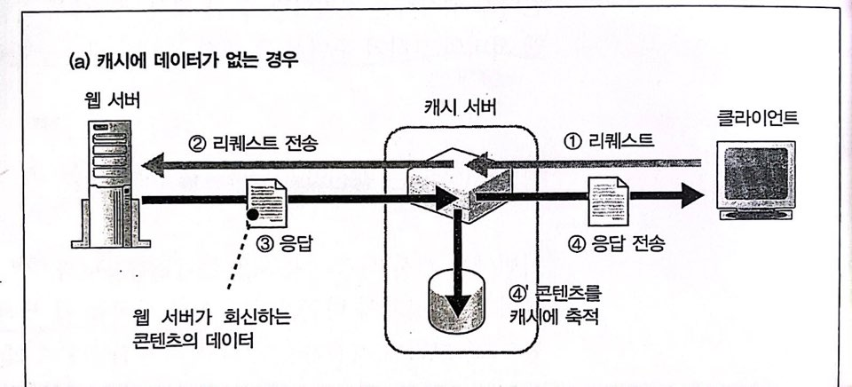

0. 캐시 서버를 웹 서버 대신 DNS 서버에 등록
1. 리퀘스트
    - 접속을 기다리는 패킷을 만들고
    - 사용자가 접속하면 접속 동작을 실행해 메시지를 받음

### 캐시에 데이터가 없는 경우

2. 리퀘스트 전송
    - 2-1. 'Via' 헤더 필드 추가
    - 2-2. 전송할 웹 서버 판단
        - 웹 서버가 한 대인 경우: 도메인명이나 IP주소를 지정
        - 웹 서버가 여러 대인 경우: 메시지에 따라 웹 서버를 판단
            - URL이 /dir1/이면 www1.lab.cyber.co.kr에 전송
            - URL이 /dir2/이면 www2.lab.cyber.co.kr에 전송
    - 2-3. 웹 서버에 대해 캐시 서버가 클라이언트가 되어 리퀘스트 전송

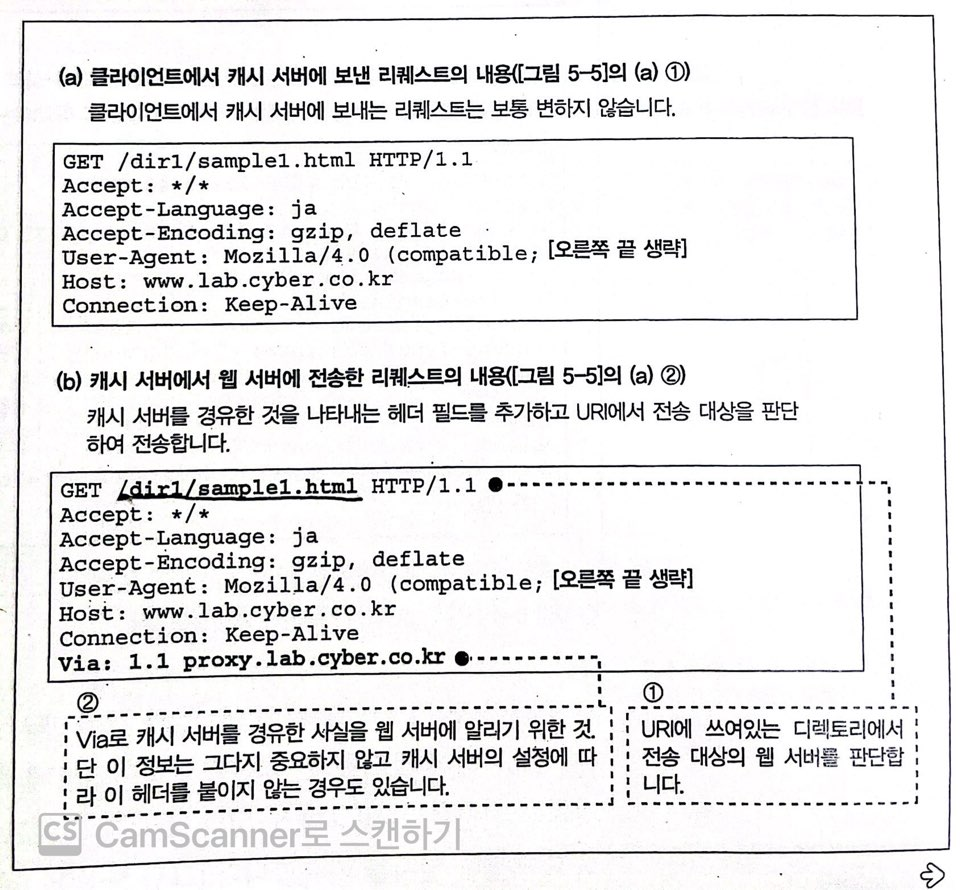

3. 응답
    - 웹 서버에 대해 클라이언트가 되어 받음
4. 응답 전송
    - 4-1. 'Via' 헤더 필드 추가
    - 4-2. 클라이언트에 대해 웹 서버가 되어 전송
    - 4-3. 응답 메시지를 캐시에 저장하고 일시 기록

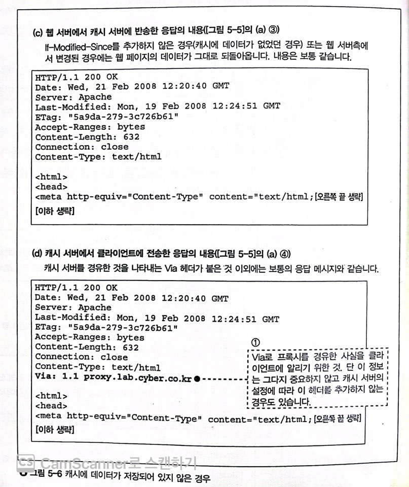

### 캐시에 데이터가 있는 경우

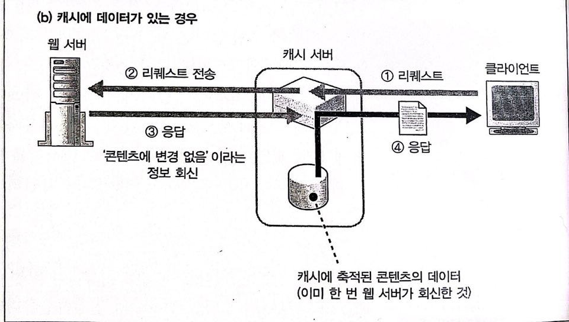

2. 리퀘스트 전송
    - 'If-Modified-Since' 헤더 필드 추가

3. 응답
    - 웹 서버는 'If-Modified-Since' 헤더 필드 값과 페이지 데이터 최종 갱신 일시 비교
        - 갱신 일시만 조사하므로 데이터를 전송하는 것보다 부담이 적음

4. 응답 전송
    - 캐시 서버가 캐시 데이터를 추출해 사용자에게 전송

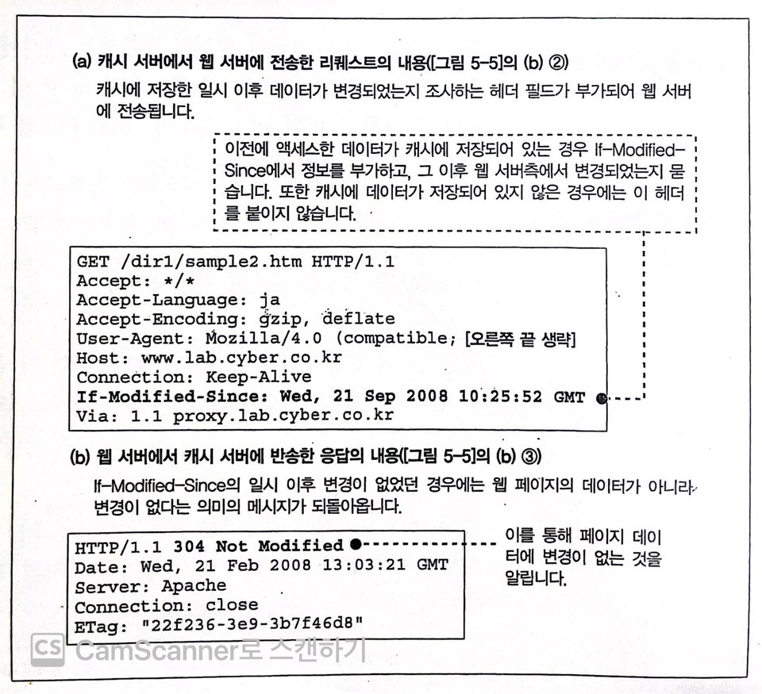

 
 

## 3. 프록시

### 3-1. 포워드 프록시

- 클라이언트에 두는 프록시. 프록시의 원형
- 방화벽으로 사용
    - 패킷을 전부 정지시키면 인터넷에 대한 액세스도 정지
    - 프록시에서 리퀘스트 메시지를 받아서 인터넷으로 전송
        - 캐싱을 사용하면 더 효과적
            - 이전에 액세스한 페이지는 사내 LAN에서 프록시에 액세스
            - 저속 회선에서 인터넷에 액세스 하는 것보다 빠름
            - ADSL, FTTH 기술 등장 이전 연구 결과의 하나
        - 내용에 따라 액세스가 가능한지 판단 가능
            - 위험한 사이트나 작업과 관계 없는 사이트는 금지
            - 패킷 필터링형 방화벽은 IP주소와 포트 번호만 사용하므로 자세한 조건 설정 불가

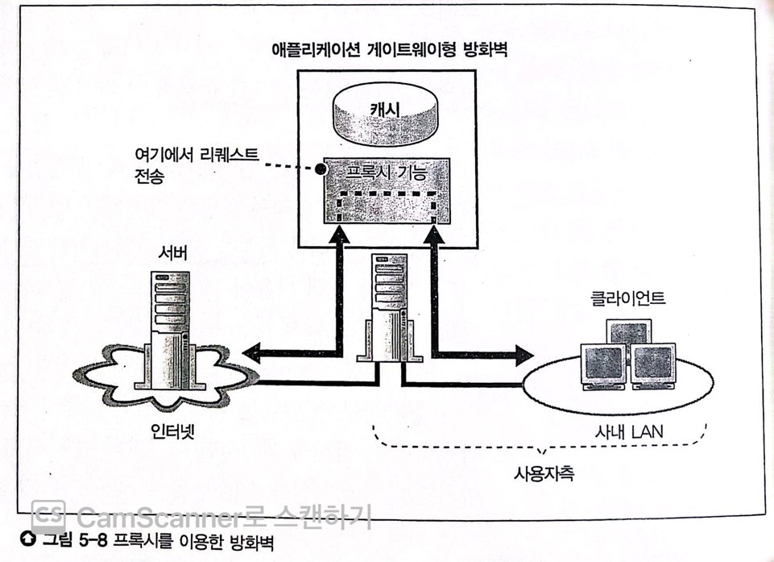

 
 

포워드 프록시 동작

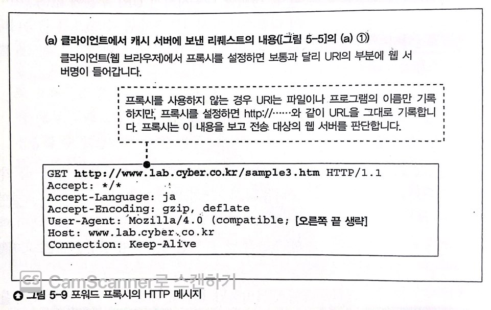

- 브라우저의 설정 화면 프록시 서버라는 항목에 포워드 프록시 IP주소 설정
- 브라우저 리퀘스트 메시지 송신 동작이 달라짐
    - 포워드 프록시 설정하지 않은 경우
        - URL 문자열에서 웹 서버를 계산해 메시지를 보냄
    - 포워드 프록시 설정한 경우
        - URL 내용에 관계 없이 전부 포워드 프록시에 보냄
- 웹 서버를 판단하는 부분도 서버측 캐시 서버와 다름
    - 전송 대상의 웹 서버를 사전에 설정하지 않고 모든 웹 서버에서 전송

### 3-2. 리버스 프록시

- 포워드 프록시는 브라우저에 대한 설정 필요
    - 설정이 잘못될 경우 장애 발생
- 인터넷에 공개하는 웹 서버는 바로 앞에 프록시를 두지 않음
    - 누가 액세스하는지 알수 없고, 브라우저에 프록시 설정 불가
- 브라우저에 프록시를 설정하지 않아도 사용하도록 개량
    - 리퀘스트 메시지 URI에 쓰여있는 디렉토리명과 전송 대상의 웹 서버를 대응

### 3-3. 트랜스패런트 프록시

- 액세스 대상 웹 서버를 직접 판단
    - 리퀘스트 메시지 패킷의 IP 헤더로부터 웹 서버를 특정
    - 포워드 프록시와 리버스 프록시의 좋은 점을 모음
        - 브라우저의 프록시 설정 필요 없음
        - 캐시 서버에 전송 대상을 설정할 필요도 없음

- 리퀘스트 메시지 수신 방식
    - 브라우저가 웹 서버에 리퀘스트 메시지를 보냄
    - 트랜스패런트 프록시는 DNS 서버에 등록하지 않음
        - 등록하면 프록시 자체가 액세스 대상이 되어 액세스 대상 웹 서버를 직접판단하는 형태가 아님
    - 브라우저에서 웹 서버로 리퀘스트 메시지가 전송되는 중간에 설치, 메시지를 인터셉트
        - 메시지가 흐르는 길이 많으면 한 개로 수렴하는 네트워크를 만들고, 수렴되는 곳에 프록시 설치
        - 액세스 회선에 설치해도 됨

- 사용자가 프록시의 존재를 알아차릴 필요가 거의 없음

# Story 5 콘텐츠 배포 서비스

## 1. CDS를 이용한 부하 분산

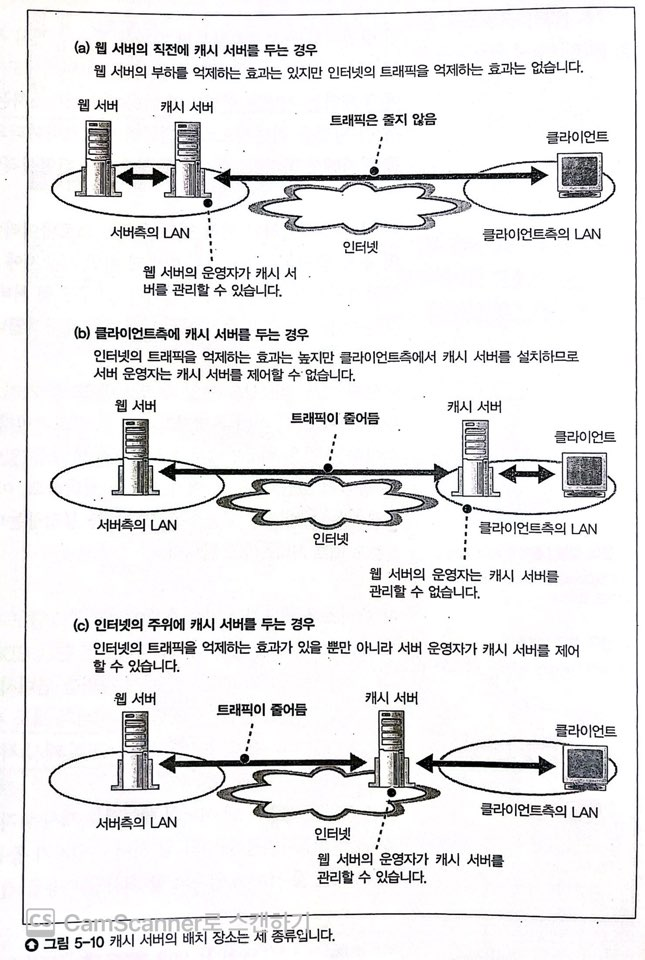

### 캐시 서버 위치에 따른 이용 효과 차이
- 서버측
    - 웹 서버 부하 경감 효과 O. 인터넷 트래픽 억제 효과 X
- 클라이언트측
    - 인터넷 트래픽 억제 효과 O, 웹 서버 부하 경감 효과 X
    - 화상, 영상 같은 대용량 데이터 컨텐츠
    - 단, 서버 운영자가 제어할 수 없음
- 인터넷 주위 - 클라이언트 측 프로바이더
    - 서버측, 클라이언트측 장점을 합쳤지만 인터넷의 어디에서 엑세스하는지 알수 없고, 프로바이더(POP)가 너무 많음.
    - 중요한 프로바이더에 설치(ex. NOC)하면 해결.

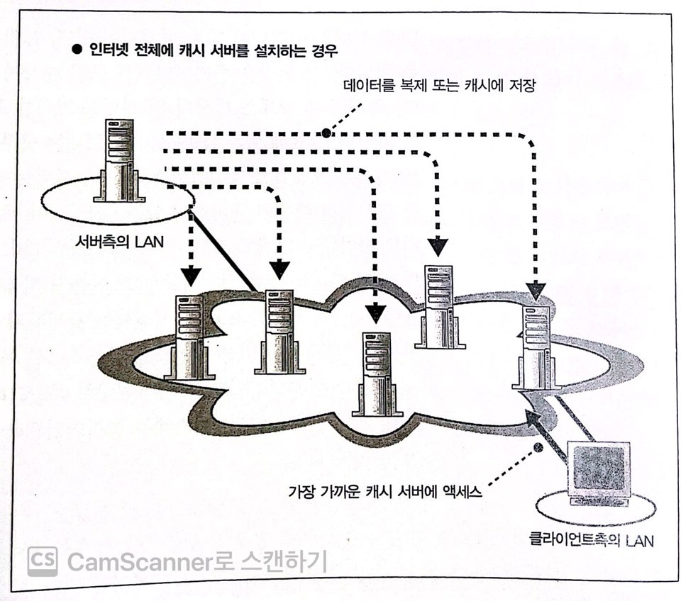

### 콘텐츠 배포 서비스 (CDS)
- 캐시 서버를 설치하고, 웹 서버 운영자에게 대출하는 서비스
- 콘텐츠 배포 서비스 프로바이더 (CDSP)
    - 웹 서버 운영자가 프로바이더와 계약하고 캐시 서버를 설치하는 비용과 노력을 없애줌
- 웹 서버와 캐시 서버를 연대
    - 클라이언트가 웹 서버에 액세스할때 CDSP의 캐시 서버에 액세스
    - 다수의 웹 서버 데이터를 캐시에 저장. 웹 서버 운영자당 비용 절감

## 2. 가장 가까운 캐시 서버 중계 방식

핵심

    다수가 있는 캐시 서버 중에서 가장 가까운 캐시 서버을 찾음
    클라이언트가 여기에 액세스하도록 중재

    DNS 서버가 웹 서버의 IP 주소를 회답할때 가장 가까운 캐시 서버의 IP주소를 회답하도록
    DNS 서버를 세밀하게 설정

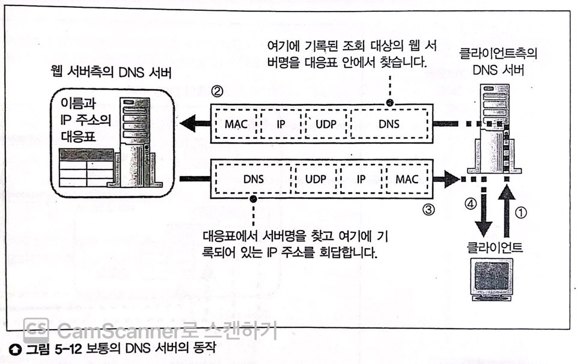

한 개의 이름에 복수의 IP 주소를 대응시킨 경우
- 라운드 로빈으로 차례로 IP 주소를 회답
- 그대로 사용하면 클라이언트와 먼 캐시 서버 IP를 응답할 수도 있음

### 2-1. DNS 서버의 직접 중계

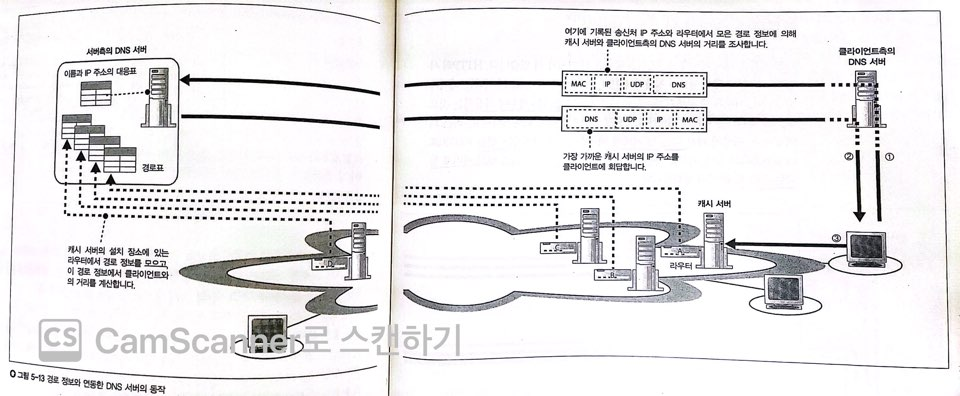

과정
1. 각각의 라우터에서 경로표를 입수해 DNS 서버에 모음
2. 클라이언트측의 DNS 서버에 이르는 경로 정보 조사
    - 모든 라우터에 대해 조사해 비교하면 클라이언트측 DNS 서버와 가장 가까운 라우터 확인 가능
    - 정확한 거리는 아니지만 웬만큼 측정할 수 있음

### 2-2. 리다이렉트를 통한 중계

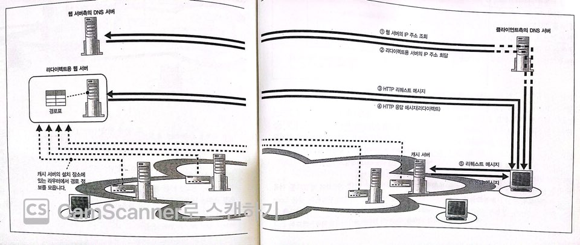

'Location' 헤더를 이용한 리다이렉트 활용
- 웹 서버의 데이터를 다른 서버로 옮기는 경우에 사용

과정
1. 리다이렉트용 서버를 웹 서버측의 DNS 서버에 등록
2. 리다이렉트용 서버에 조회
3. 가장 가까운 캐시 서버 서치, Location 헤더를 붙여 응답
4. 캐시 서버에 다시 액세스

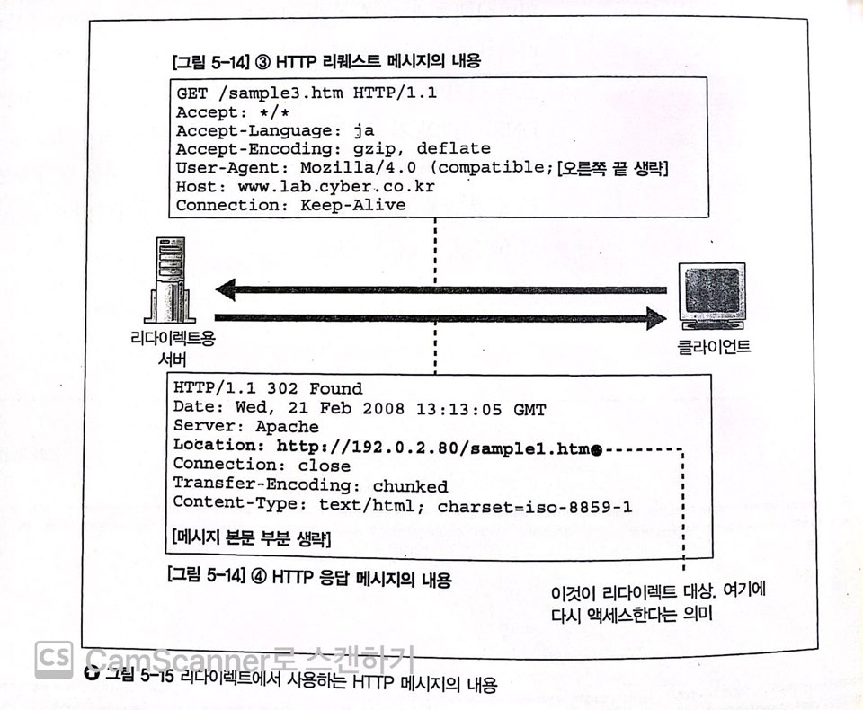

장단점
- 단점: HTTP 대화가 증가하므로 오버헤드 증가
- 장점: 거리 정밀도가 높음
    - 클라이언트이 송신처 IP 주소를 바탕으로 거리 판단
    - DNS 서버 설정 방식은 클라이언트측 DNS 서버와 캐시 서버의 거리를 계산하므로 정밀도가 떨어짐

또 다른 방법
- 패킷의 왕복 시간을 통해 캐시 서버까지의 거리를 계산
- 스크립트 프로그램을 내장한 페이지를 반송
    - 몇 캐시 서버에 시험으로 패킷을 보내고 가장 RTT가 짧은 캐시 서버에 요청을 재전송

## 3. 캐시 갱신 방식과 성능

기존 캐싱 방식의 한계

    캐싱원리: 한 번 액세스한 데이터를 저장하고 두 번째 이후의 액세스의 효율 높이기
- 최초의 액세스 동작은 느림
- 두 번째 이후에도 갱신 여부를 계속 체크

개선점
- 웹 서버에서 원래 데이터를 갱신하면 즉시 캐시 서버에 반영
    - 원 데이터 갱신 확인 필요 X
    - 최초 엑세스 동작에도 캐시 데이터 사용
- 동적으로 페이지를 만드는 경우
    - 캐시 서버에 저장하면 안 됨
    - 페이지의 내용이 달라지지 않는 부분만 저장