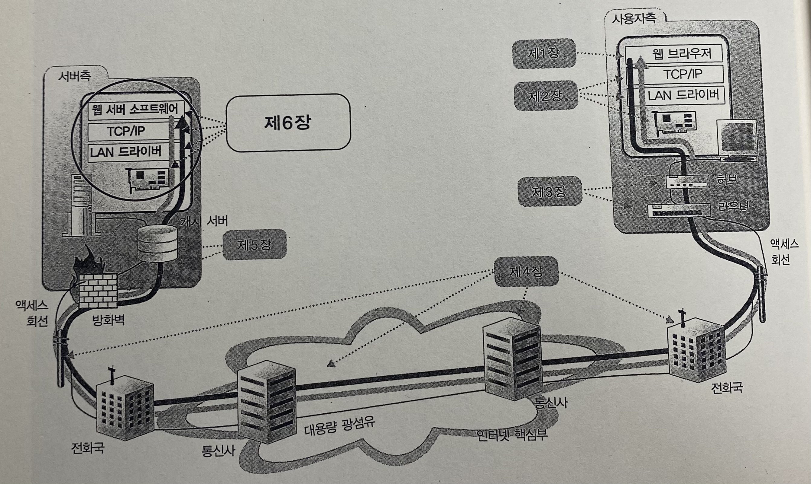
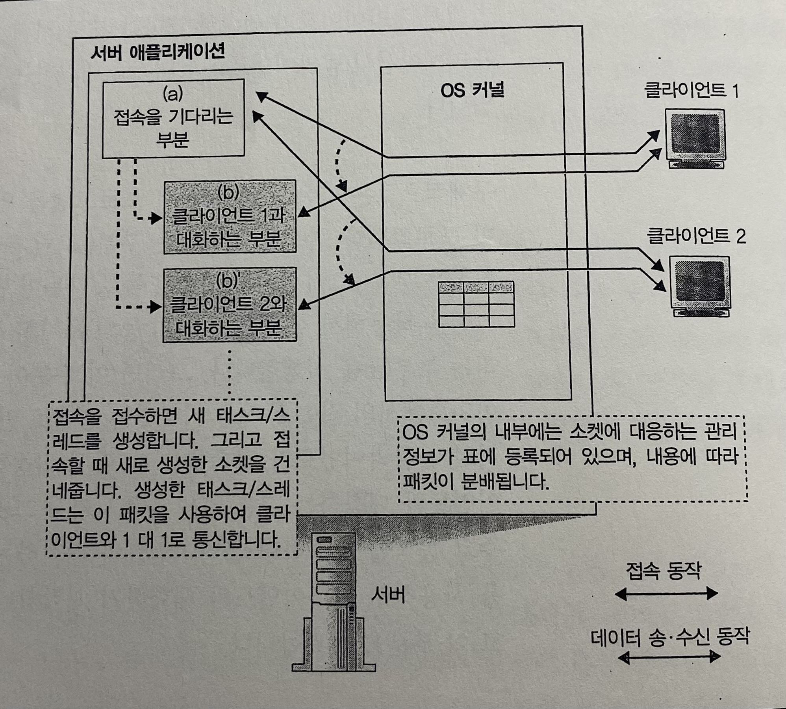
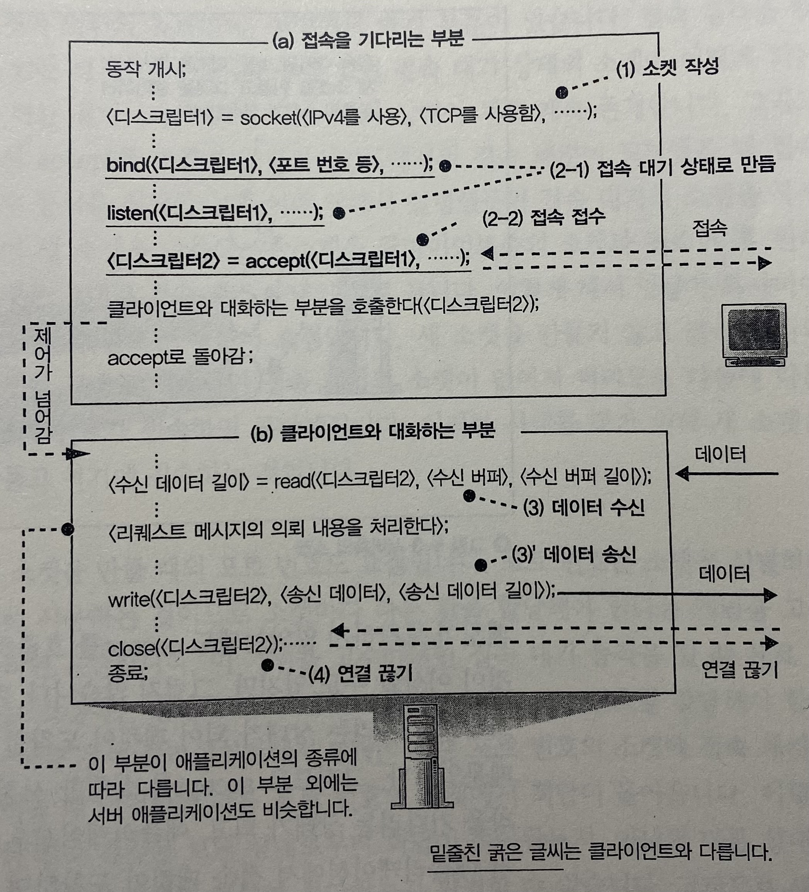
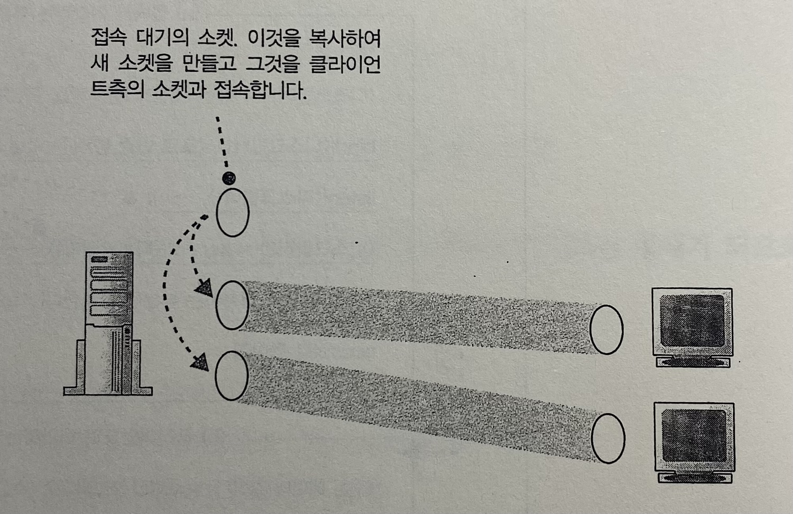
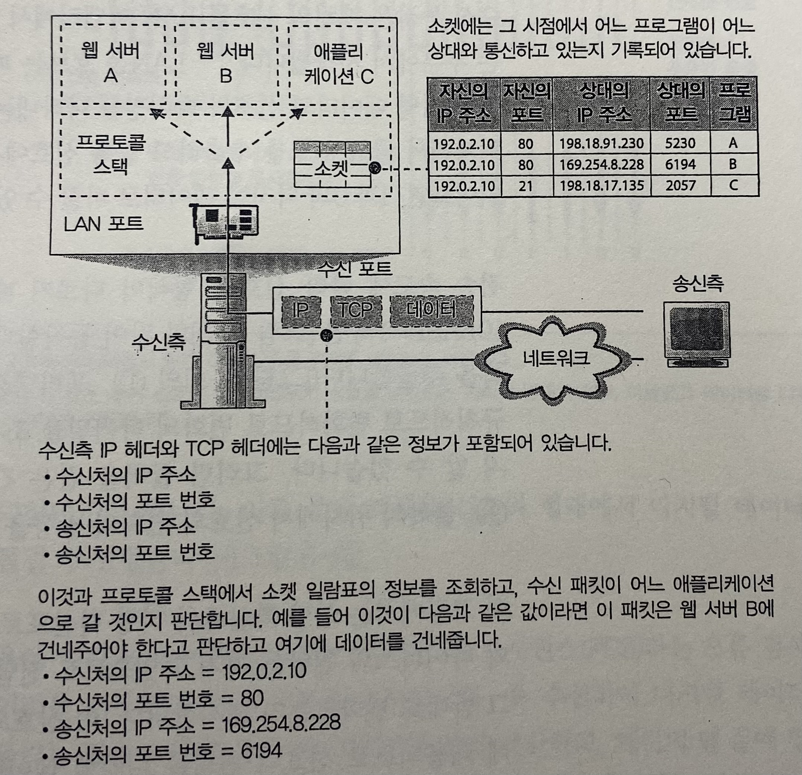
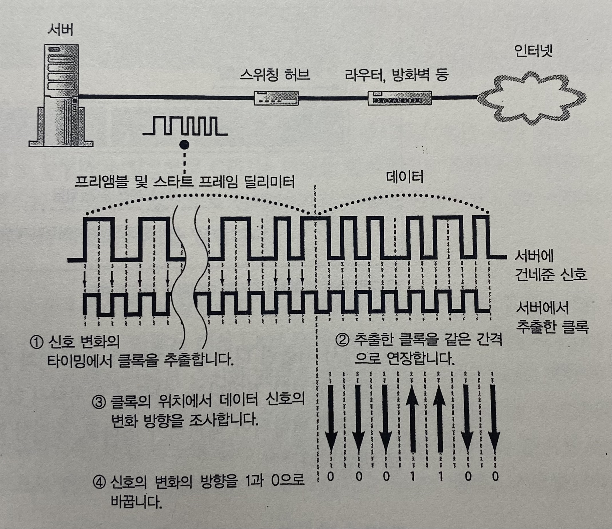
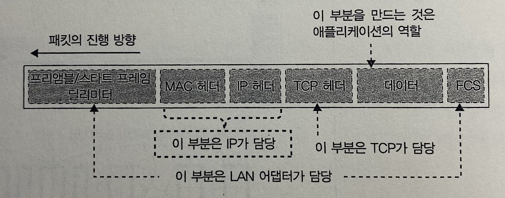

> 발표일 `25.04.10`
>
> 발표자 `박지환`

# Chapter 6. 웹 서버에 도착하여 응답 데이터가 웹 브라우저로 돌아간다. (Story 1~2)

\*서버측

## 목차

- Story 1. 서버의 개요
  1. 클라이언트와 서버의 차이점
  2. 서버 애플리케이션의 구조
  3. 서버측의 소켓과 포트 번호
      
- Story 2. 서버의 수신 동작
  1. LAN 어댑터에서 수신 신호를 디지털 데이터로 변환한다
  2. IP 담당 부분의 수신 동작
  3. TCP 담당 부분이 접속 패킷을 수신했을 때의 동작
  4. TCP 담당 부분이 데이터 패킷을 수신했을 때의 동작
  5. TCP 담당 부분의 연결 끊기 동작

## Story 1. 서버의 개요

### 1.1 클라이언트와 서버의 차이점

- 같은 구성: LAN 어댑터, 프로토콜 스택, Socket 라이브러리 등.
- 다른 사용방법:
  - Socket 라이브러리 사용법
  - 서버의 애플리케이션은 1:N 클라이언트와 대화

### 1.2 서버 애플리케이션의 구조

\*서버 애플리케이션 내부

- 서버 애플리케이션 구조 2개 부분:

  1. 접속 대기
  2. 클라이언트와 대화 (서버 OS의 멀티태스크 기능)

- 단점: 클라이언트 접속 시 새로 프로그램을 기동하는건 시간 소요.
  - 해결: 미리 몇 개의 클라이언트와 대화하는 부분을 작동.

### 1.3 서버측의 소켓과 포트 번호

\*서버측의 소켓

\*접속 대기 소켓을 복제하는 모습

- 소켓 동작 방식:

  1. bind의 포트 번호는 서버 애플리케이션마다 다름 (예: 웹 서버는 80)
  2. accept를 미리 호출하면 '기다리는 상태'가 됨.
  3. 접속 패킷이 도착하면 접속 대기의 소켓을 복사.

\*수신한 패킷의 분배

- 소켓 포트의 문제:

  - 포트 번호는 소켓 식별자.
  - 그렇다고 복제된 소켓마다 다른 포트 번호를 할당하면 안 됨.
  - 접속 시 다른 포트에서 응답이 오면 클라이언트가 판별 불가능하기 때문.

- 해결:

  - 복제된 소켓은 접속 대기 소켓과 같은 포트 번호 사용.
  - 대신 클라이언트 IP 주소, 클라이언트 포트 번호, 서버 IP 주소, 서버 포트 번호 함께 사용.

## Story 2. 서버의 수신 동작

### 2.1 LAN 어댑터에서 수신 신호를 디지털 데이터로 변환하기

\*전기 신호를 디지털 데이터로 전환

\*신호에서 디지털 데이터로 되돌린 패킷

1. 디지털 데이터로 전환.
2. FCS 확인해서 오류 유무 검사.
3. MAC 헤더의 수신처 MAC 주소가 자신이 맞는지 확인.
4. LAN 어댑터 내부 버퍼 메모리에 디지털 데이터 저장.
5. LAN 어댑터에서 '인터럽트'를 통해 CPU에게 패킷의 도착을 알림.
6. CPU가 LAN 드라이버를 실행해서 버퍼 메모리에서 패킷을 추출 & TCP/IP 프로토콜 스택 호출하고 패킷 건네줌.

### 2.2 IP 담당 부분의 수신 동작

- IP 헤더 점검
  1. 자신을 대상으로 한 것인지 판단.
  2. 조각 나누기(fragmentation)에 의한 패킷의 분할이 있는지 조사. (있으면 조립될 때까지 메모리에 저장)
  3. 프로토콜 번호 조사해서 TCP 혹은 UDP 담당 부분에 패킷 전달. (예: 06은 TCP, 11은 UDP)

### 2.3 TCP 담당 부분이 접속 패킷을 수신했을 때의 동작

1. TCP 헤더의 SYN의 컨트롤 비트 확인. (SYN=1)
2. 수신처 포트 번호 조사. (해당 포트의 접속 대기 소켓이 없으면 오류)
3. 접속 대기 소켓 복사.
4. 송신처 IP 주소, 포트 번호 등을 기록.

### 2.4 TCP 담당 부분이 데이터 패킷을 수신했을 때의 동작

1. 도착한 패킷의 송신처 IP 주소, 송신처 포트 번호, 수신처 IP 주소, 수신처 포트 번호를 통해 소켓 판단.
2. 데이터 조각 연결해서 수신 버퍼에 보관.
3. 클라이언트에게 ACK을 돌려줌.
4. read를 호출하여 애플리케이션에 데이터를 전달.

### 2.5 TCP 담당 부분의 연결 끊기 동작

1. 서버측에서 close를 호출.
2. TCP 담당 부분이 FIN 컨트롤 비트를 1롤 설정한 TCP 헤더를 IP 담당 부분에 의뢰.
3. 클라이언트에 도착하면 ACK를 반환.
4. 클라이언트도 FIN=1을 보냄.
5. 서버도 ACK를 반환.
