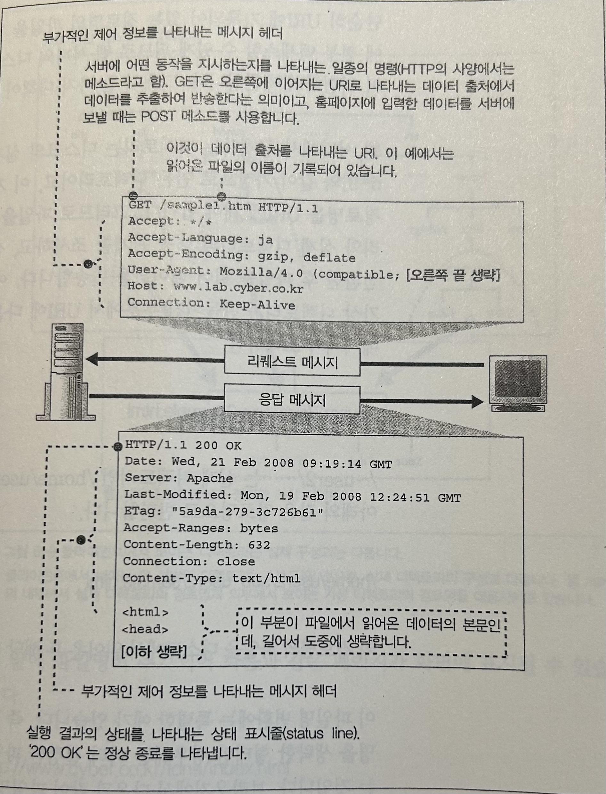
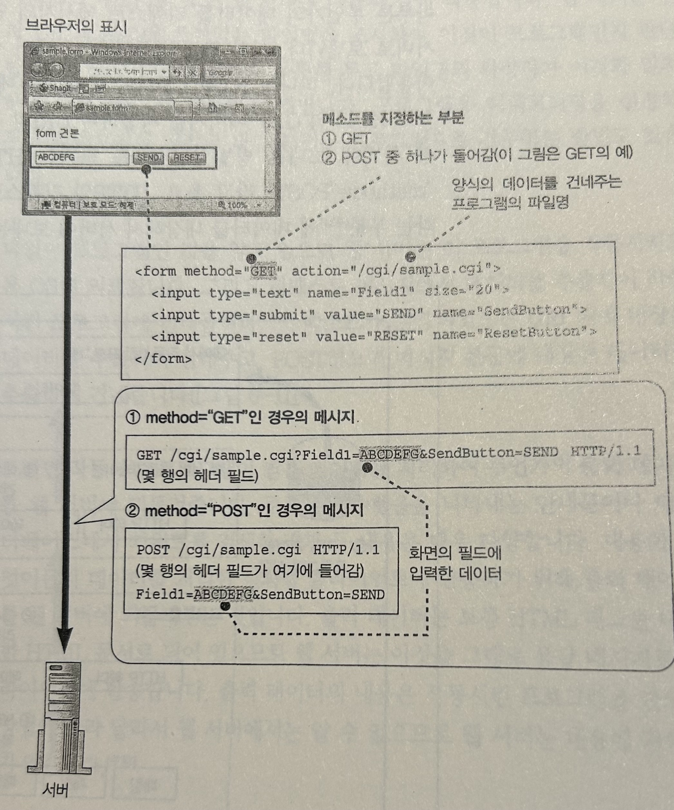
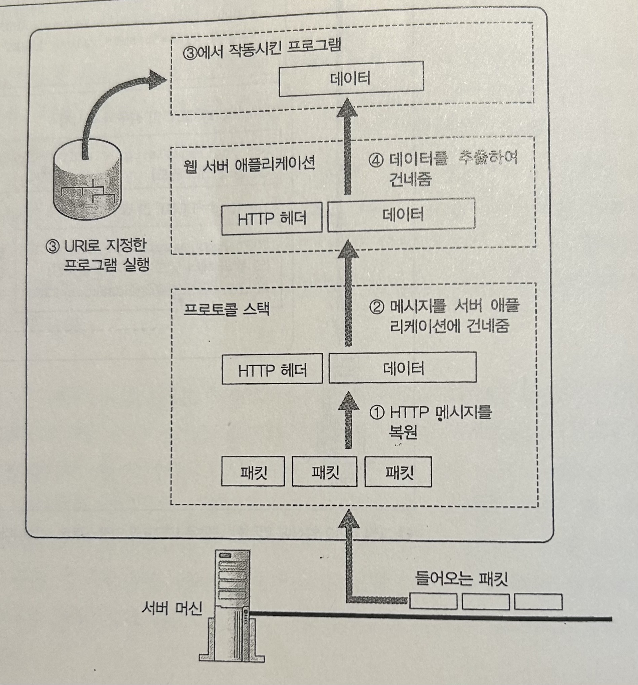

> 발표일 `25.04.15`
>
> 발표자 `정예찬`

 
 

# Chapter 6. 웹 서버에 도착하여 응답 데이터가 웹 브라우저로 돌아간다. (Story 3~4)

 
 

## Story 3. 웹 서버 소프트웨어가 리퀘스트 메시지의 의미를 해석하여 요구에 응한다.

### 1. 조회의 URI를 실제 파일명으로 변환한다.

 
 

 

" <리퀘스트 메시지의 의뢰 내용을 처리한다> " 부분에 대하여 알아본다.

실제로는 어플리케이션마다 여기서 다양한 동작이 진행된다.

 
 
 

- read 에서 받은 파일 데이터의 내용이 HTTP 리퀘스트 메시지가 된다.
- 받은 리퀘스트 메시지에 기록되어 있는 내용에 따라 적절한 처리를 실행하여 응답 메시지를 만든다
- 만든 메시지를 클라이언트에 반송한다.
 
 
- 리퀘스트 메시지에는 메소드라는 일종의 명령과 데이터 출처를 나타내는 URI 라는 파일의 경로명 같은 것이 쓰여있다.
- 메소드와 URI에 따라 웹 서버 내부의 동작이 달라진다.
 
 
  

 
 

위 그림의 예시는 GET 매소드로 HTML의 문서의 파일명을 나타내는 URI을 기록한 리퀘스트이다.
 
 

 
 

단순히 URI에 기록되어 있는 파일을 디스크에서 읽는 것은 아니다.

- 웹 서버에서 공개하는 디렉토리는 디스크의 실제 디렉토리가 아니라 가상으로 만든 디렉토리이다.
 

 

예를 들어 위의 그림에서

`/~user2/sub-user2/sample.htm`

와 같은 경로로 리퀘스트를 한다면

`/home/user2/sub-user2/sample.htm`

이 경로명의 파일을 디스크에서 읽어온 후 해당 데이터를 반송하는 형태입니다.

 
 
 

URI만 쓰여있는 경우에는 미리 설정한 파일명이 쓰여있는 것으로 간주한다.

`http://www.cyber.co.kr/tone/`
으로 요청을 한다면, 
 

`http://www.cyber.co.kr/tone/index.html`
의 페이지가 화면에 표시될 수 있다.

 

> 기본 파일명은 웹 서버의 설정 파일에 설정할 수 있다. 
> 
> 파일명은 자유로이 설정할 수 있지만 일반적으로
> 'index.html', 'index.cgi', 'default.html' 등을 사용한다.

 
 

 
 

### 2. CGI 프로그램을 작동하는 경우
 

<a href="https://www.ibm.com/docs/ko/i/7.5.0?topic=functionality-cgi">CGI가 뭐예요?</a>

URI에 쓴 내용이 HTML 문서나 화상 데이터인 경우에는 파일의 내용을 그대로 응답 메시지로 클라이언트에 반송합니다.

하지만 프로그램 파일의 이름을 URI에 쓰는 경우에는 해당 프로그램을 작동시켜서 프로그램이 출력하는 데이터를 클라이언트에 반송합니다.

웹 서버에서 작동시키는 프로그램은 몇 가지 유형이 있지만, CGI 라는 타입의 프로그램의 동작 방식을  설명합니다.

 

 
 

HTML 문서의 form 부분에 `method="GET"` 이라고 쓰고 HTTP의 GET 메시지를 사용하여 URI의 뒤에 입력 데이터를 내장해서 서버에 보내는 방법

또 하나는 HTML 문서의 양식 부분에 `method="POST"`라고 쓰고, HTTP 리퀘스트 메시지 본문에 데이터를 내장해서 서버에 보내는 방법입니다.

 

 
 

리퀘스트 메시지를 보낸 웹 서버는 다음과 같이 작동합니다.

- URI의 부분에 쓰여있는 파일명을 조사하여 이것이 프로그램인지 판단합니다. (프로그램용 디렉토리를 설정해 두고 해당 디렉토리의 파일을 전부 프로그램으로 간주하는 방법도 있습니다.)
- 웹 서버는 이 프로그램을 작동시키도록 OS에 의뢰합니다.
- 이 때 리퀘스트 메시지에서 데이터를 추출하여 작동시킨 프로그램에 건네줍니다
- GET 이면 URI 뒤에 내장된 데이터를, POST이면 메시지 본문에 내장된 데이터를 추출하여 건내줍니다.
- 작동시킨 프로그램이 받은 데이터를 처리하여 무언가의 출력 데이터를 웹 서버에 되돌려줍니다.

### 3.웹 서버로 수행하는 엑세스 제어

조건에 따라 엑세스 여부를 설정하는 것을 엑세스 제어라고 합니다.

웹 서버에서는 주로 다음의 3가지로 조건을 설정합니다.
1. 클라이언트의 주소
 - 클라이언트의 IP 주소를 알 수 있으므로 이것을 점검한다.
2. 클라이언트의 도메인명 (사용 X)
 - 클라이언트의 IP 주소에서 도메인 명을 조사한다. 
3. 사용자명과 패스워드
 - 사용자명과 패스워드를 입력받아 이것을 리퀘스트 메시지에 기록하고, 서버에 엑세스 합니다.
  
  => 실제로는 JWT 인증 / OAuth 기반 제어, CORS + 인증 헤더 등의 방식을 사용합니다.

 
 
 
 
 
 

## Story 4. 브라우저가 응답 메시지를 받아 화면에 표시한다.

### 1. 응답 데이터의 형식을 보고 본질을 판단한다.

웹 서버가 보낸 응답 메시지는 패킷으로 나누어 클라이언트에 도착하는데, 이렇게 되면 클라이언트 측에서 이것을 수신합니다.
LAN 어댑터가 원래의 응답 메시지로 되돌린 후 브라우저에게 전달합니다.

화면 표시 동작은 다음과 같이 진행됩니다.

1. 응답 메시지에 저장된 데이터가 어떤 종류인지 조사합니다.

- 응답 데이터의 헤더의 `Content-Type` 필드로 이를 판단합니다.

`Content-Type: text/html`

/의 왼쪽 부분은 주 타입, 오른쪽 부분을 서브 타입이라고 합니다.
주 타입은 데이터 종류의 대분류를, 서브 타입은 실제 데이터의 종류를 나타냅니다.

데이터의 종류가 텍스트인 경우에는 어떤 문자 코드를 사용하는지 판별하기 위해 charset으로 문자 코드의 정보를 부가할 수 있습니다.

`Content-Type: text/html; charset = utf-8

- `Content-Encoding` 이라는 헤더 필드도 조사합니다.

압축 기술이나 부호화 기술에 따라 원래 데이터를 변환하였다면 어떤 변환을 했는지 이 필드에 기록합니다.

Content-type 필드를 사용하여 데이터의 종류를 나타내는 방법은 `MIME`이라는 사양에 규정되어 있습니다.

<a href="https://developer.mozilla.org/ko/docs/Web/HTTP/Guides/MIME_types">MIME</a>

다른 판단 근거를 사용할 수도 있습니다.
요청한 파일의 확장자나 데이터 포맷등에서 종합적으로 판단하는 것입니다.
 
ex) .html 의 확장자, 문서의 시작 부분에 `<html>` 존재, 화상 데이터의 맨 앞부분에 정보가 기록된 경우가 있음
(브라우저 사양)

### 2.브라우저 화면에 웹 페이지를 표시하여 엑세스를 완료한다.

HTML 문서, 일반 텍스트, 화상 데이터는 브라우저 자체에서 화면을 표시할 수 있습니다.

HTML 문서의 경우, 문장의 레이아웃이나 글꼴의 종류를 기록한 태그가 있으므로 태그의 의미를 해석하여 문장을 배치하면서 화면에 표시합니다.

웹 페이지에는 화상을 내장한 것도 있습니다.
이 경우 HTML 문서와 화상 데이터를 별도의 파일로 저장하고 HTML 태그 안에 화상이 내장되었음을 나타내는 태그를 작성합니다.

HTTP 리퀘스트의 URI 부분에 화상 데이터의 파일명을 쓰면 됩니다.

워드 프로세서나 프레젠테이션 어플리케이션 데이터가 있을 수도 있는데, 이 경우에는 브라우저 자체에서 표시 할 수 없기 때문에 해당 어플리케이션을 호출하게 됩니다. 이 어플리케이션은 브라우저에 플러그인 형태로 편입된 형태일 수도 있고, 독립된 프로그램 일수도 있습니다.